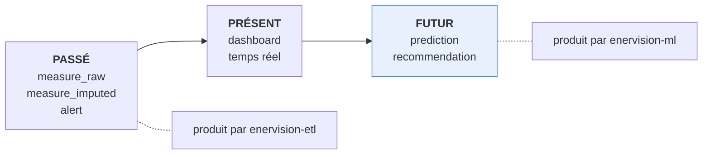
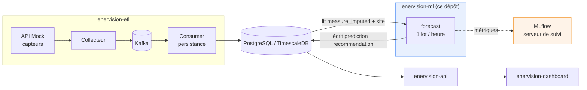
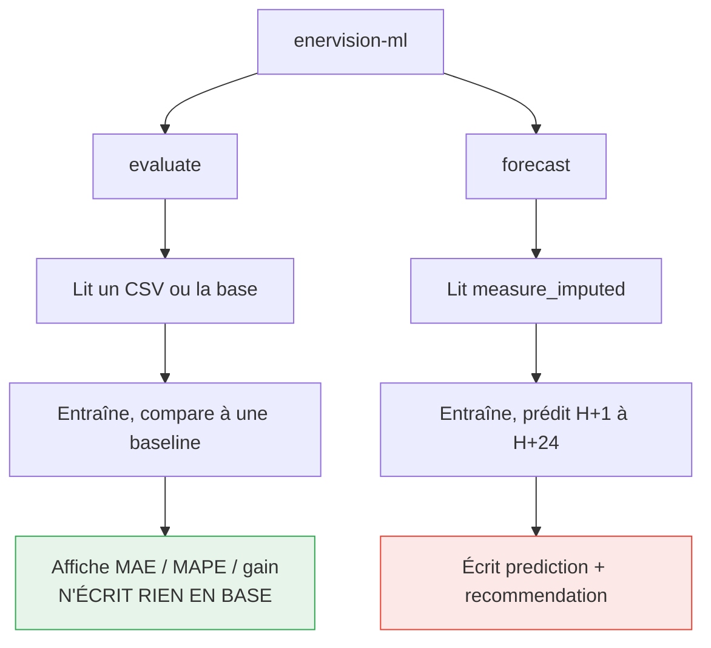
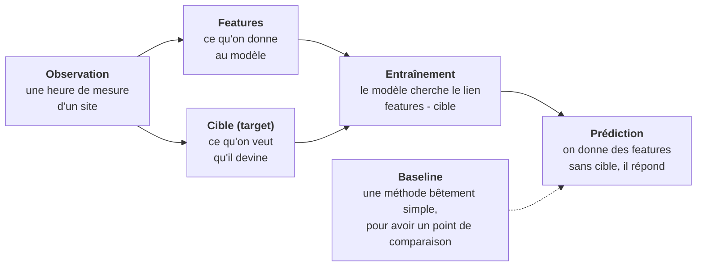
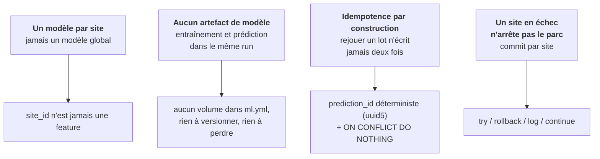

# 1. Vue d'ensemble

## 1.1 Le problème métier

EnerVision supervise un parc de sites industriels équipés de compteurs électriques.
Les autres services du projet racontent le **passé** : ce qui a été consommé, ce qui a
déclenché une alerte.

`enervision-ml` est le seul service qui parle du **futur** : *combien ce site va-t-il
consommer dans les 24 prochaines heures, et va-t-il dépasser sa capacité ?*

L'intérêt est opérationnel : savoir à 14 h qu'un site dépassera son seuil à 18 h laisse
quatre heures pour déplacer une charge, alors qu'une alerte à 18 h ne laisse que le
constat.

## 1.2 Place dans l'architecture

Le service ne parle à personne directement : il lit une table, il écrit deux tables. La
base est le point de rendez-vous entre les équipes.

Conséquences directes de ce choix :

- **aucun couplage réseau** avec l'ETL ou l'API : si le service ML tombe, rien d'autre ne
  tombe, le dashboard affiche simplement des prévisions qui vieillissent ;
- **une seule connexion PostgreSQL** sert la lecture de l'historique et l'écriture des
  prévisions, dans une transaction par site.

## 1.3 Les deux commandes

Le dépôt expose une CLI à deux commandes, qui répondent à deux besoins différents.

| Commande | Rôle | Écrit en base ? | Besoin d'infrastructure ? |
|---|---|---|---|
| `evaluate` | Prouver que le modèle apprend quelque chose | Non | Non (un CSV suffit) |
| `forecast` | Le service réel, en boucle dans un conteneur | Oui | Oui (PostgreSQL) |

`evaluate` est la commande de la soutenance : elle se lance sur un portable, sans base,
sans Docker, et sort un tableau chiffré.

## 1.4 Le vocabulaire minimal

Cinq mots suffisent pour lire le reste de cette documentation.

- **Observation** : une ligne de données. Ici, *le site SITE001, le 12 mars à 14 h, a
  consommé 320 kW, il faisait 8 degrés et 60 % d'humidité*.
- **Features** (variables d'entrée) : les colonnes qu'on autorise le modèle à regarder.
  Ici : heure, jour, week-end, mois, température, humidité.
- **Cible** : la colonne qu'on lui demande de deviner. Ici : `consumption_kw`.
- **Entraînement** : on montre au modèle quelques milliers d'observations complètes
  (features **et** cible), il en déduit des règles.
- **Baseline** : une méthode volontairement simpliste. Si le modèle ne la bat pas, il ne
  sert à rien, et c'est cette comparaison qui rend le chiffre crédible.

## 1.5 Les quatre principes directeurs du dépôt

Ils expliquent la majorité des choix techniques détaillés dans les documents suivants.

Suite : [Le modèle](02-le-modele.md)
