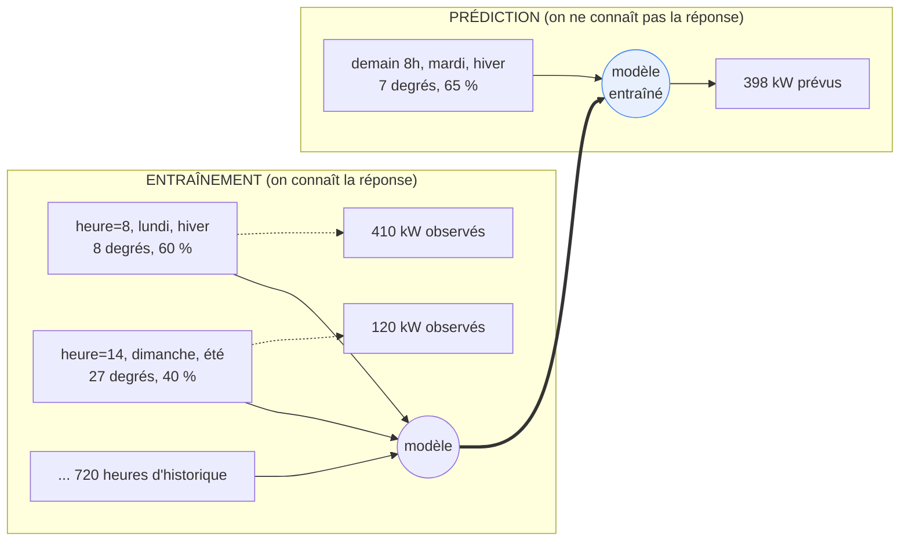
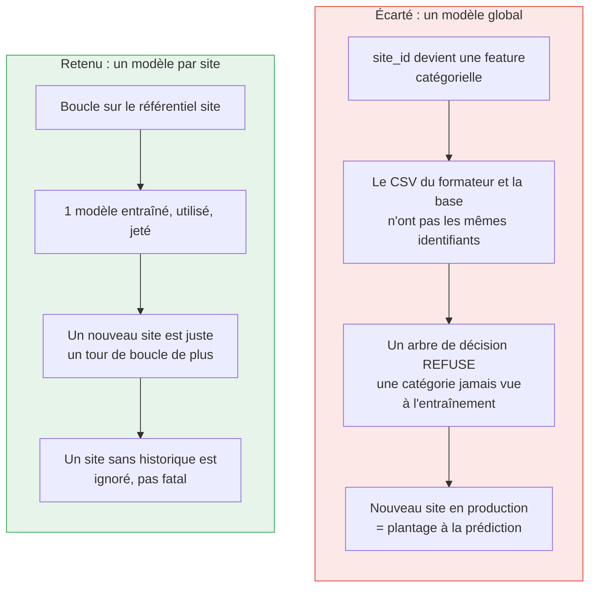
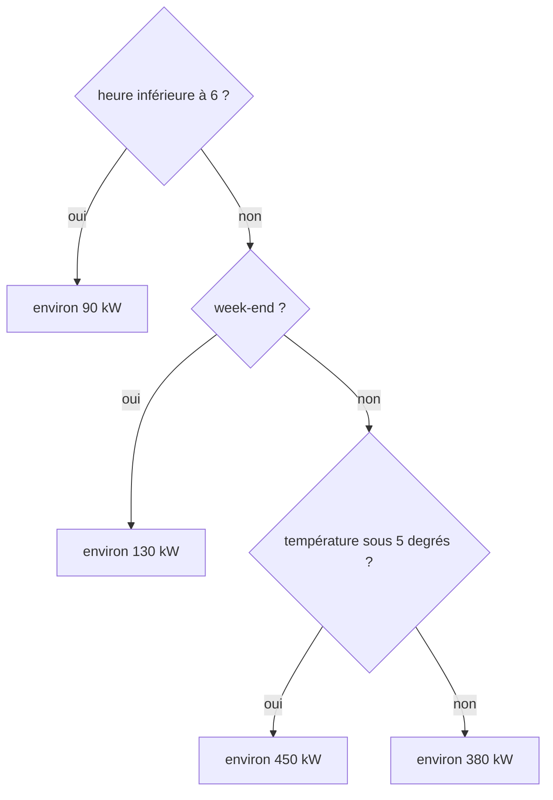
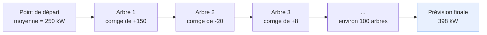
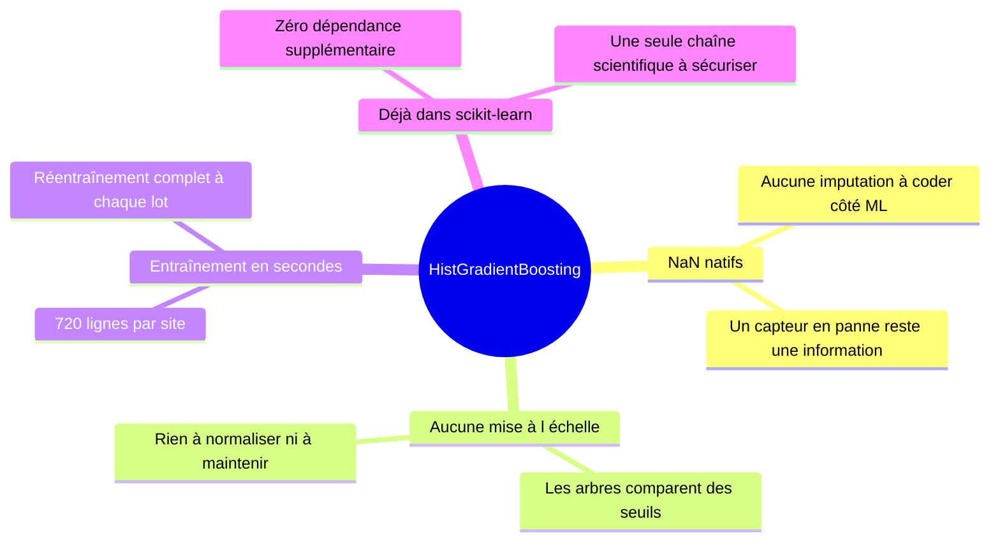
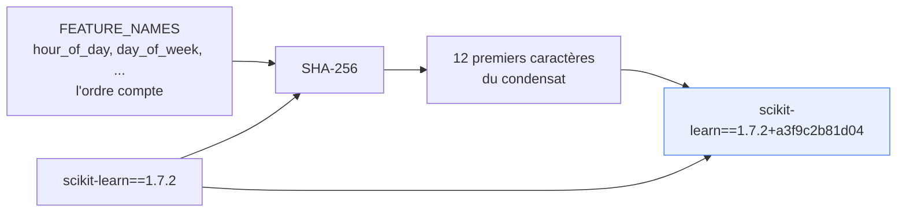
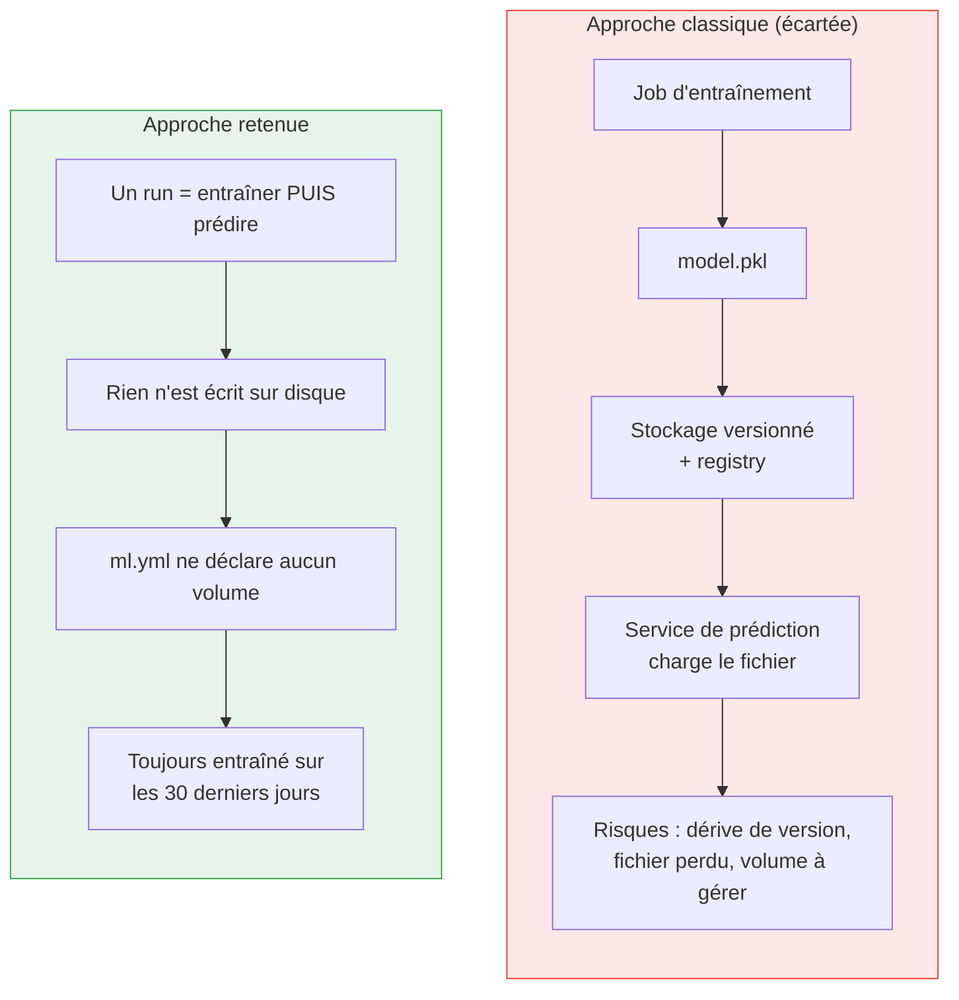

# 2. Le modèle

## 2.1 Ce que le modèle apprend, concrètement

Le modèle est une **fonction** que l'on ne sait pas écrire à la main, et que l'ordinateur
reconstruit à partir d'exemples :

```
puissance appelée (kW)  =  f( heure, jour de semaine, week-end, mois, température, humidité )
```

Personne ne connaît la formule exacte de `f` : elle dépend du site, de ses machines, de
ses horaires d'équipe, de son chauffage. Le principe de l'apprentissage supervisé est de
**ne pas** l'écrire, mais de montrer à l'algorithme quelques milliers de couples
(entrées, sortie observée) et de le laisser en déduire les règles.



## 2.2 Les six variables d'entrée

Définies dans [`transform/features.py`](../src/enervision_ml/transform/features.py), dans
un ordre figé (`FEATURE_NAMES`).

| Feature | Type | Pourquoi elle est là |
|---|---|---|
| `hour_of_day` | 0-23 | Le rythme le plus fort d'un site industriel : équipes, machines, éclairage |
| `day_of_week` | 0-6 | Lundi ne ressemble pas à samedi |
| `is_weekend` | 0 / 1 | Déductible du précédent, mais donne directement la coupure à l'arbre |
| `month` | 1-12 | Capte la saison : chauffage, climatisation, durée du jour |
| `temperature_celsius` | float ou NaN | Le facteur météo dominant de la consommation électrique |
| `humidity_percent` | float ou NaN | Second facteur météo, disponible dans les deux sources |

Trois décisions moins évidentes :

**Le calendaire est recalculé depuis l'horodatage UTC**, jamais lu dans une colonne
précalculée du CSV. Ces colonnes sont probablement en heure locale : les utiliser
entraînerait le modèle sur un calendrier décalé de celui de la production, où tout est en
UTC.

**Une valeur manquante vaut `NaN`, jamais zéro.** Zéro est une température valide ; le
confondre avec « capteur en panne » apprendrait au modèle une corrélation fausse.

**`site_id` n'est pas une feature.** C'est le point suivant.

## 2.3 Pourquoi un modèle par site



Deux arguments, dans cet ordre :

1. **Métier** : deux sites n'ont pas le même profil. Un entrepôt frigorifique et un
   atelier d'usinage n'ont ni la même sensibilité à la température ni les mêmes horaires.
   Un modèle global devrait apprendre à la fois le profil commun *et* l'écart de chaque
   site ; un modèle par site apprend directement le bon.
2. **Technique** : les identifiants de site diffèrent selon la source. Un modèle global
   ferait de `site_id` une variable catégorielle, et un arbre de décision entraîné sur
   `SITE001..SITE007` lève une erreur si on lui présente un site inconnu. Le service
   deviendrait fragile au moment précis où le parc grandit.

Le coût de ce choix est assumé : entraîner N modèles au lieu d'un. Il est négligeable ici
(quelques secondes pour 720 points par site) et il est détaillé en 2.6.

## 2.4 L'algorithme retenu : `HistGradientBoostingRegressor`

Une famille d'algorithmes bien identifiée : le **gradient boosting sur arbres de
décision**, dans son implémentation scikit-learn optimisée par histogrammes (la même
famille que LightGBM, dont elle s'inspire directement).

### Comment il fonctionne, en une image

Un arbre de décision seul est une suite de questions oui/non :



Le boosting empile ces arbres : chaque nouvel arbre ne prédit pas la consommation, il
prédit **l'erreur qui reste** après les précédents.



C'est ce mécanisme de correction successive qui lui permet de capter des effets non
linéaires (la consommation ne monte pas proportionnellement au froid, elle a des paliers)
et des interactions (l'effet de la température n'est pas le même un dimanche à 3 h du
matin qu'un mardi à 9 h) sans qu'on ait à les déclarer.

### Pourquoi celui-là et pas un autre

Trois critères ont piloté le choix, dans cet ordre : **exactitude sur données tabulaires**,
**coût d'exploitation**, **absence de dépendance supplémentaire**.

| Candidat | Verdict | Raison |
|---|---|---|
| **Régression linéaire** | Écarté | La consommation n'est pas linéaire en heure ni en température. Il faudrait encoder la saisonnalité à la main (sinus/cosinus, variables muettes par heure) : plus de code, moins bon |
| **k plus proches voisins** | Écarté | Aucune extrapolation, sensible à l'échelle des variables (il faudrait normaliser et maintenir cette normalisation), et coût de prédiction croissant avec l'historique |
| **RandomForest** | Écarté | Même famille, mais moyenne d'arbres indépendants plutôt que correction successive : à taille égale, moins précis sur ce type de séries, et n'accepte pas les `NaN` nativement |
| **XGBoost / LightGBM / CatBoost** | Écarté | Performance équivalente à `HistGradientBoosting` sur des jeux de cette taille, mais **une dépendance externe de plus** à installer, versionner et sécuriser, pour un gain non mesurable ici |
| **SARIMA / Prophet** | Écarté | Modèles de série temporelle pure : ils extrapolent une saisonnalité mais intègrent mal des variables exogènes comme la météo, et exigent un paramétrage (ordres, saisonnalités) par site |
| **LSTM / réseaux de neurones** | Écarté | Demandent beaucoup plus de données que 30 jours par site, un GPU ou de longues minutes de CPU, et une phase de réglage d'hyperparamètres. Sur données **tabulaires** de cette taille, le gradient boosting reste la référence |
| **`HistGradientBoostingRegressor`** | **Retenu** | Voir ci-dessous |

Les quatre propriétés qui ont emporté la décision :



1. **Il accepte les `NaN` nativement.** L'algorithme apprend lui-même de quel côté de
   chaque question envoyer une valeur manquante. Sans cette propriété, il faudrait coder
   une stratégie d'imputation côté ML, alors que l'ETL en a déjà une, tracée.
2. **Aucune mise à l'échelle n'est nécessaire.** Un arbre compare `temperature < 5`, il ne
   fait pas de calcul de distance : mélanger des degrés, des pourcentages et des heures ne
   pose aucun problème. Une régression ou un kNN exigeraient un `StandardScaler` à
   entraîner, sauvegarder et rejouer à l'identique en prédiction.
3. **Il s'entraîne en quelques secondes** sur l'historique d'un site (720 lignes pour
   30 jours). C'est ce qui rend viable le principe « pas d'artefact » : réentraîner à
   chaque lot coûte moins cher que gérer un cycle de vie de fichiers de modèle.
4. **Il est déjà dans scikit-learn**, déjà présent pour le reste du service.

### Hyperparamètres

Aucun n'est réglé, en dehors de `random_state=0` pour la reproductibilité. Les valeurs par
défaut de scikit-learn (une centaine d'itérations, 31 feuilles au maximum, taux
d'apprentissage 0,1) sont des valeurs de référence solides sur données tabulaires. Une
recherche d'hyperparamètres exigerait un jeu de validation distinct du jeu de test, donc
un découpage à trois pans sur un historique déjà court : le risque de sur-ajuster le
réglage lui-même dépasse le gain attendu à ce stade du projet.

## 2.5 L'empreinte du modèle : `model_version`

Chaque prévision écrite en base porte une chaîne `model_version`, calculée par
[`transform/model_version.py`](../src/enervision_ml/transform/model_version.py) :



Elle identifie un **contrat** — quelles variables, dans quel ordre, avec quelle version de
bibliothèque — et non une expérimentation particulière. Deux runs sur des historiques
différents mais avec le même contrat produisent la même empreinte.

C'est ce qui la rend utilisable comme clé d'idempotence en base *et* comme axe de
comparaison dans MLflow : ajouter une feature change l'empreinte, donc sépare visiblement
les métriques de l'ancien et du nouveau contrat (voir [MLflow](05-mlflow.md)).

## 2.6 Ce que le modèle ne fait pas, et pourquoi

| Limite | Raison assumée |
|---|---|
| **Pas de features retardées** (consommation à H-24, H-168) | C'est le levier de précision le plus important en prévision de charge, et son absence plafonne le modèle. Il exige la disponibilité de l'historique récent au moment de prédire et une stratégie multi-horizon (pour une prévision à H+24, la valeur « 24 h avant » n'est elle-même pas encore connue). Écarté en v1 ; `FEATURE_NAMES` est conçu pour l'accueillir sans rien casser |
| **Pas de prévision météo réelle** | Prédire à H+24 demande la température de H+24, que rien ne fournit dans le périmètre du projet. Elle est remplacée par la moyenne climatologique du site, voir [pipeline](03-pipeline-de-donnees.md) |
| **Pas d'intervalle de confiance** | Le service écrit une valeur, pas une fourchette. La table `prediction` n'a pas de colonne pour cela, et le modèle est un régresseur ponctuel |
| **Pas de `solar_irradiance_wm2`** | Présente dans le CSV du formateur, absente de `measure_imputed`. Les features sont l'**intersection stricte** des deux sources : une variable présente à l'entraînement mais absente en production ferait un modèle inutilisable |
| **Aucun artefact de modèle persisté** | Voir ci-dessous |

### Le choix « pas d'artefact »



Un artefact serait perdu à chaque redémarrage du conteneur, puisque `ml.yml` ne déclare
aucun volume. Plutôt que d'ajouter un volume, un registre et un cycle de vie de fichiers
pour un modèle qui s'entraîne en quelques secondes, l'entraînement et la prédiction ont
lieu dans le même run. Effet de bord favorable : le modèle est **toujours** entraîné sur
les 30 derniers jours, il ne peut pas devenir périmé silencieusement.

C'est aussi pourquoi MLflow ne reçoit **que des métriques**, jamais de modèle : il n'y a
rien à versionner côté artefacts.

Suite : [Le pipeline de données](03-pipeline-de-donnees.md)
