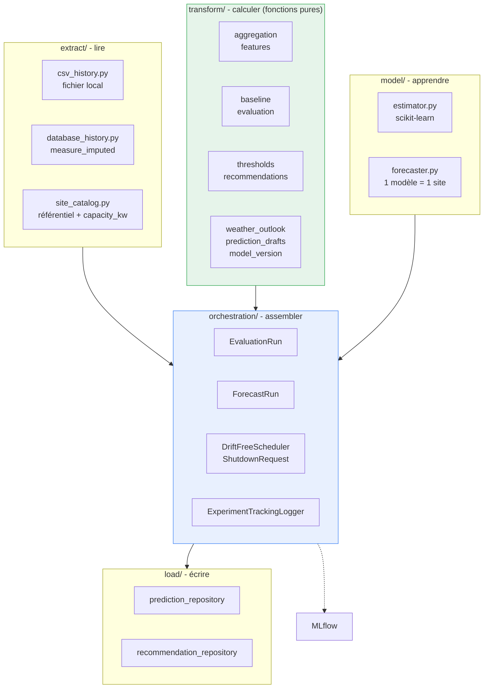
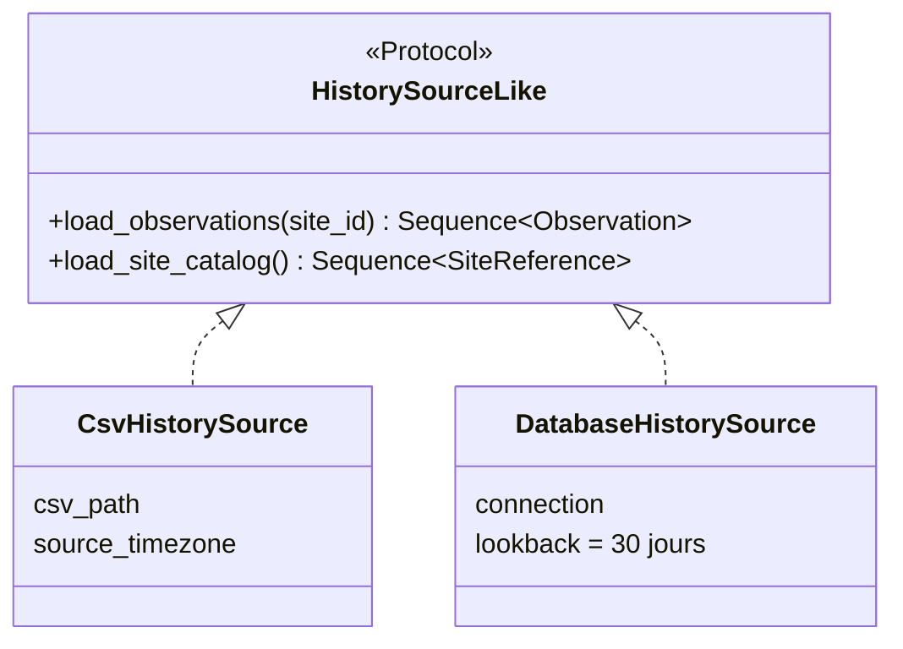
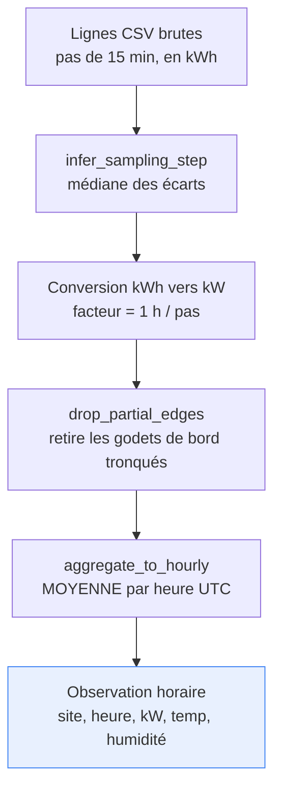
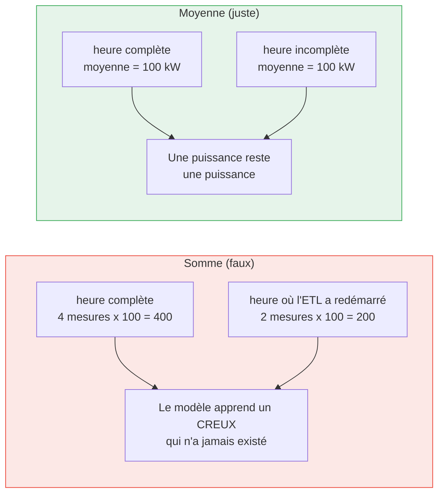
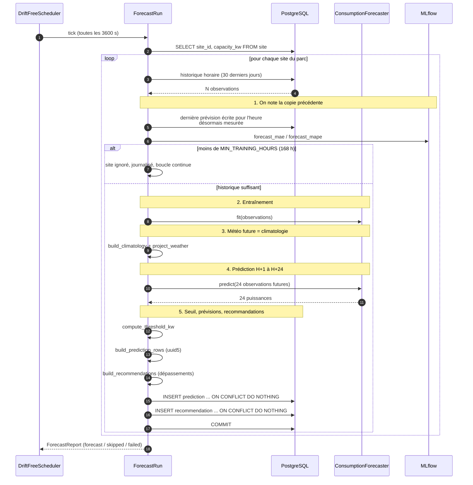
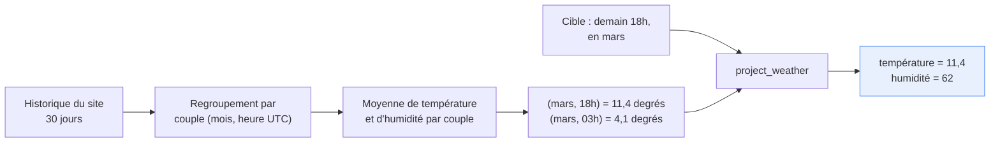
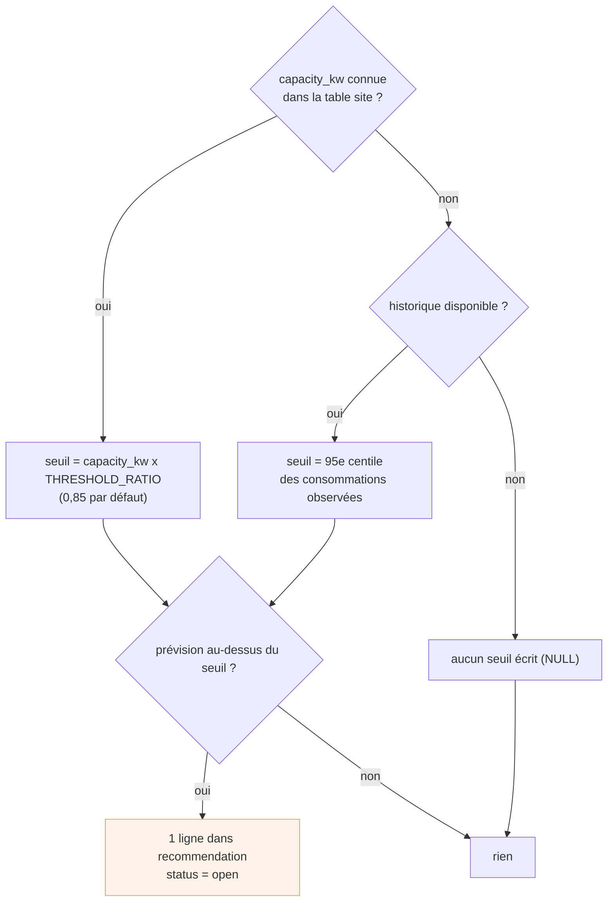
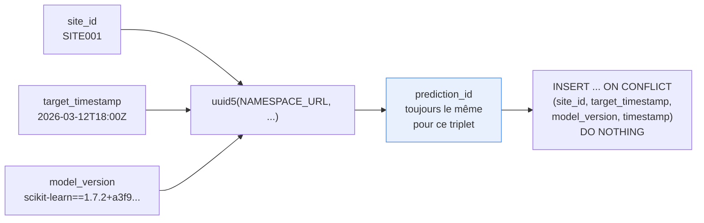
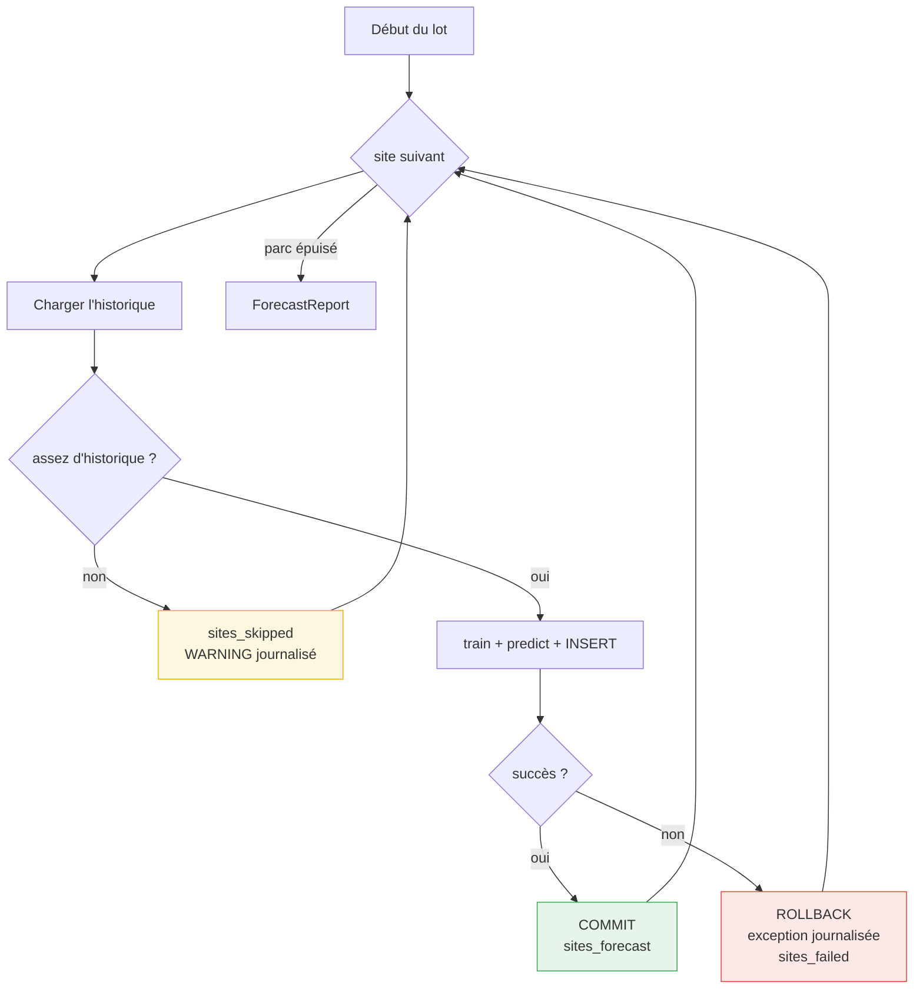

# 3. Le pipeline de données

## 3.1 Les cinq couches

Le dépôt suit la même séparation que `enervision-etl` : chaque couche a un rôle unique, et
les dépendances vont toujours dans le même sens.

Règle structurante : **`transform/` ne contient que des fonctions pures** (mêmes entrées,
mêmes sorties, aucun effet de bord, aucun SQL, aucune horloge). C'est ce qui rend les 146
tests unitaires du dépôt exécutables sans base de données, sans réseau et sans MLflow.

Inversement, **`orchestration/` ne contient aucune règle métier ni aucun SQL** : il
n'assemble que les couches situées en dessous.

## 3.2 Les deux sources d'historique, derrière un seul contrat

Un `Protocol` Python plutôt qu'une classe abstraite : les deux implémentations n'héritent
de rien, et un double de test satisfait le contrat sans rien importer de concret.

| | `CsvHistorySource` | `DatabaseHistorySource` |
|---|---|---|
| Source | Fichier du formateur | Table `measure_imputed` |
| Unité d'origine | kWh au pas source | kW déjà normalisés par l'ETL |
| Agrégation horaire | En Python (`transform/aggregation.py`) | En SQL (`date_trunc` + `avg`) |
| `capacity_kw` | Inconnue (repli percentile) | Lue dans la table `site` |
| Utilité | `evaluate` hors infrastructure | Le service réel |

Deux détails qui ont demandé une décision :

- **`date_trunc` plutôt que `time_bucket`** côté SQL. `time_bucket` est la fonction
  TimescaleDB ; `date_trunc` est du PostgreSQL standard. La requête reste exécutable sur un
  Postgres nu, sans dépendre d'une extension qui pourrait ne pas être activée sur
  l'environnement de destination.
- **`WHERE site_id = %s` en clause dédiée**, pas en paramètre nullable
  (`site_id = %s OR %s IS NULL`) : cette dernière forme empêche Postgres d'utiliser l'index
  sur `site_id` dès que le filtre est actif.

## 3.3 De la mesure brute à l'observation horaire

Le CSV du formateur est au pas de 15 minutes et en kWh ; le modèle travaille à l'heure et
en kW. Trois étapes, toutes dans `transform/aggregation.py`.

**Pourquoi la médiane des écarts** et non le premier écart observé : un seul intervalle
irrégulier en tête de série (retard de collecte, resynchronisation) fausserait toute la
conversion kWh vers kW.

**Pourquoi une moyenne et jamais une somme** : c'est le piège classique de ce pipeline.

**Pourquoi retirer les godets de bord** : une extraction par plage commence et finit
rarement pile à l'heure. Le premier et le dernier godet horaire peuvent ne contenir qu'une
fraction des mesures attendues, ce qui biaiserait leur moyenne. Les godets intérieurs
incomplets, eux, restent : c'est le rôle de la moyenne d'en tenir compte.

**Un godet sans aucune valeur connue reste absent**, jamais ramené à zéro. Même principe
que l'ETL : on ne détruit jamais l'information « il n'y avait rien ici ».

## 3.4 Un lot de prévision, de bout en bout

L'étape 1 est le **contrôle qualité en production** : avant d'entraîner le nouveau modèle,
le service confronte la prévision qu'il avait faite pour l'heure qui vient enfin d'être
mesurée. Détaillé dans [Évaluation et métriques](04-evaluation-et-metriques.md).

## 3.5 La météo du futur : la climatologie

Prédire la consommation de demain 18 h demande la température de demain 18 h. Aucun
service du projet ne la fournit. La solution retenue est la **moyenne climatologique** du
site.

Ce n'est pas une prévision météo, c'est une **valeur plausible** : « ce que fait la
température à cette heure-là, à cette période de l'année, sur ce site ». Si le couple
(mois, heure) n'a jamais été observé, la valeur reste absente, et le `NaN` natif du modèle
prend le relais plutôt qu'un zéro inventé.

**Conséquence honnête** : la commande `evaluate` mesure la performance avec la température
*réellement observée*, alors que `forecast` se rabat sur cette climatologie. Le gain
affiché par `evaluate` est donc **légèrement optimiste** par rapport à la production.
L'écart est assumé, documenté, et c'est précisément pour le mesurer qu'existe le suivi de
justesse en production (métriques `forecast_mae` dans MLflow).

## 3.6 Le seuil d'alerte et les recommandations

Le repli sur le 95e centile est un **repère observé** plutôt qu'un seuil inventé : à
défaut de connaître la capacité installée, « le site a rarement dépassé cette valeur »
reste une information exploitable. Sans capacité **et** sans historique, aucun seuil n'est
écrit : mieux vaut un `NULL` qu'un chiffre arbitraire que le dashboard afficherait comme
une vérité.

Une recommandation n'est jamais écrite sans sa prévision : les deux partent dans la **même
transaction**, validée par un seul `COMMIT` par site.

## 3.7 L'idempotence : pourquoi rejouer un lot est sans danger

Un service qui tourne en boucle et qui peut être relancé à tout moment finira par rejouer
un lot. La réponse retenue est un identifiant **déterministe**.

`DO NOTHING` et jamais `DO UPDATE` : **la première écriture gagne**. Rejouer un lot après
un échec partiel ne crée aucun doublon et ne modifie rien de ce qui existe déjà.

Une subtilité portée par le schéma (`enervision-devops/db/init/002_create_tables.sql`) :
la colonne `timestamp` (l'instant du lot) fait partie de la contrainte unique, parce
qu'une hypertable TimescaleDB exige que toute contrainte unique inclue sa colonne de
partitionnement. L'effet voulu est que **deux lots successifs conservent chacun leur
prévision** pour la même heure cible : c'est cet historique de prévisions qui permet
ensuite d'en mesurer la justesse.

## 3.8 Isolation des pannes

Un site en échec est annulé, journalisé, compté dans `sites_failed`, et **la boucle
continue sur le reste du parc**. Un seul site avec des données pathologiques ne prive pas
les six autres de leurs prévisions. C'est la même règle que le collecteur temps réel côté
ETL.

Suite : [Évaluation et métriques](04-evaluation-et-metriques.md)
