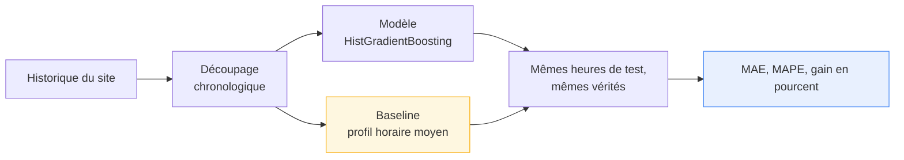
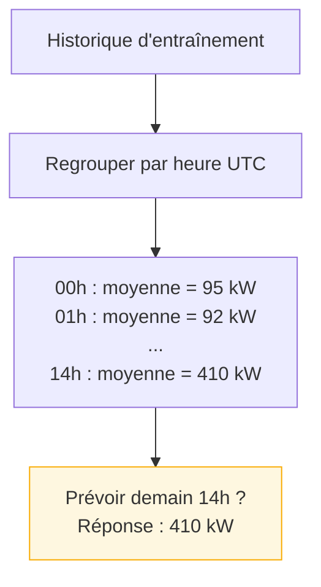
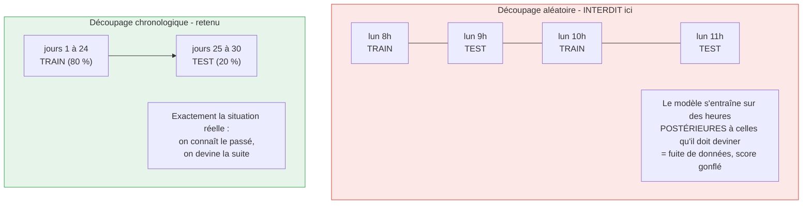
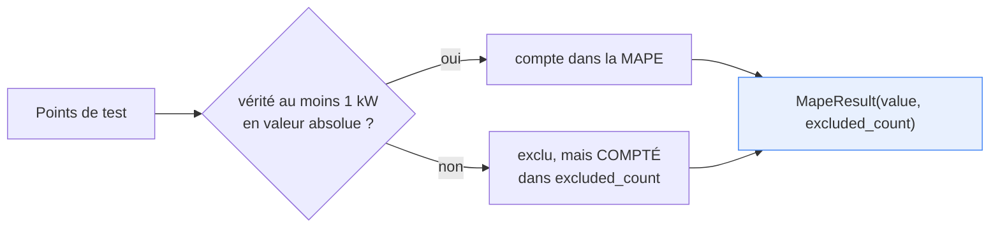
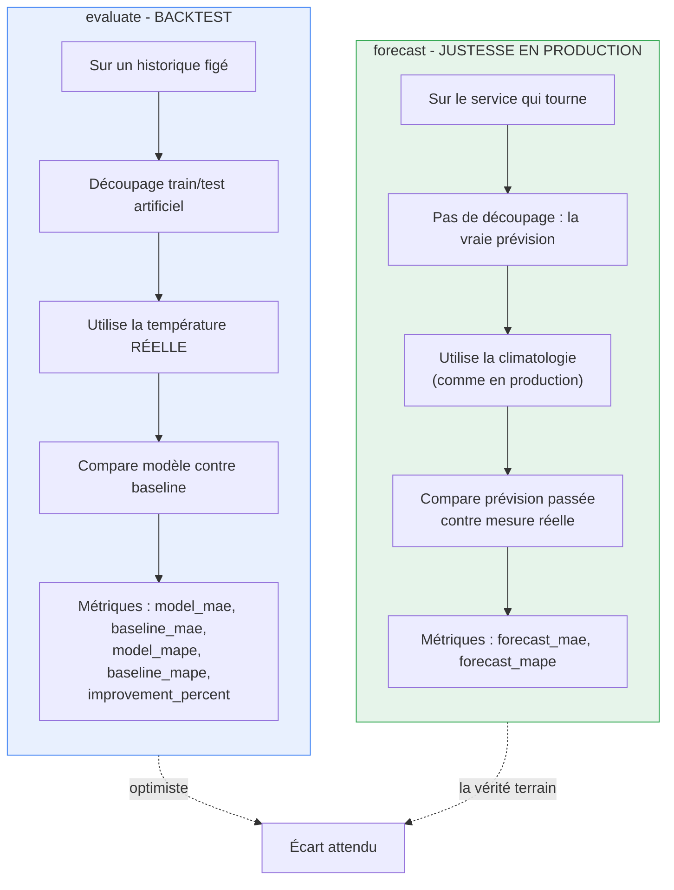
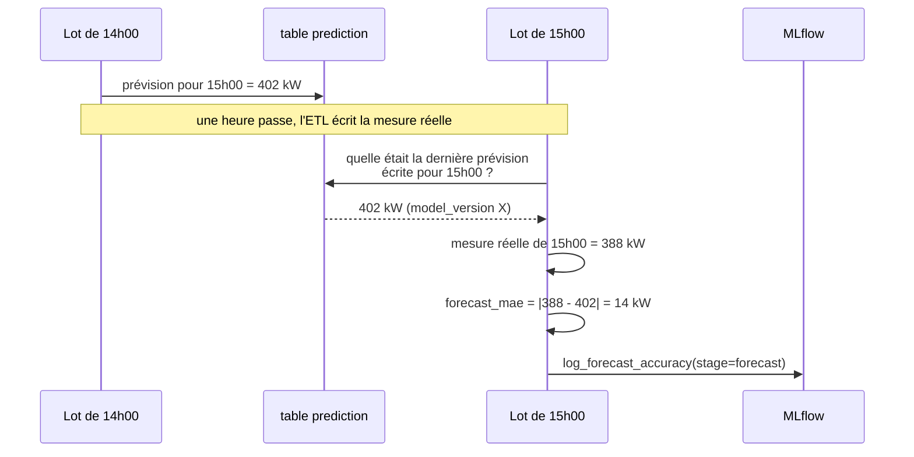

# 4. Évaluation et métriques

## 4.1 La question à laquelle il faut répondre

Un modèle produit toujours des chiffres. La seule question qui compte est : **ces chiffres
valent-ils mieux qu'une méthode que n'importe qui aurait pu écrire en dix minutes ?**

Sans point de comparaison, « MAE = 42 kW » ne veut rien dire : c'est excellent sur un site
qui consomme 2 000 kW, c'est catastrophique sur un site qui en consomme 60.

D'où la démarche du dépôt :



## 4.2 La baseline : le profil horaire moyen

C'est l'adversaire, volontairement simple : pour chaque heure de la journée, la moyenne de
ce que le site a consommé à cette heure-là dans le passé.



Elle n'est pas naïve par hasard : c'est exactement ce qu'un tableur ferait. Elle capte le
rythme journalier — le signal le plus fort — mais **ignore tout le reste** : le jour de la
semaine, la saison, la température. Battre cette baseline, c'est prouver que le modèle a
appris quelque chose que la moyenne ne contient pas.

Une précaution de code : si une heure de la journée n'a jamais été observée à
l'entraînement, la baseline retombe sur la moyenne globale plutôt que de perdre le point.
L'évaluation sanctionne alors une baseline incomplète au lieu d'écarter la comparaison.

La baseline n'est **jamais écrite en base** : elle n'existe que pour la commande
`evaluate`.

## 4.3 Le découpage chronologique

Le découpage classique en machine learning est aléatoire. Ici, il serait **faux**.



`split_chronologically` trie les observations par instant et coupe : les 80 % les plus
anciennes pour l'entraînement, les 20 % les plus récentes pour le test. Le ratio est
réglable par `--test-ratio`.

## 4.4 Les deux métriques

### MAE — erreur absolue moyenne

```
MAE = moyenne( | valeur observée - valeur prévue | )
```

En kW. Se lit directement : « en moyenne, on se trompe de 42 kW ». C'est la métrique de
référence du service, parce que son unité est celle du métier.

Le choix de la valeur absolue plutôt que du carré (RMSE) est délibéré : le RMSE pénalise
davantage les grosses erreurs, ce qui le rend très sensible aux quelques pics
exceptionnels d'un historique industriel. La MAE décrit l'erreur typique, celle qui
intéresse l'exploitant.

### MAPE — erreur relative moyenne

```
MAPE = 100 x moyenne( | (observé - prévu) / observé | )
```

En pourcentage. Sans unité, donc **comparable entre deux sites** de tailles différentes.

Un piège connu de cette métrique est traité explicitement : quand la valeur observée est
proche de zéro, l'erreur relative explose pour un écart absolu insignifiant (se tromper de
1 kW sur 0,5 kW observé donne 200 %). Les points dont la vérité est sous
`NEAR_ZERO_TRUTH_KW = 1.0` kW sont donc **exclus du calcul et comptés séparément**
(`excluded_count`), plutôt que d'être silencieusement moyennés.



### Le gain

```
gain = 100 x (MAE_baseline - MAE_modèle) / MAE_baseline
```

Positif : le modèle fait mieux. Négatif : il fait pire, et il faut le dire.

## 4.5 Le résultat mesuré

```bash
uv run enervision-ml evaluate --source csv --csv-path <fichier.csv> --test-ratio 0.2
```

Sortie, une ligne par site :

```
SITE001    model_mae=  31.42 kW  baseline_mae=  48.77 kW  model_mape=  8.12 %  baseline_mape= 12.90 %  gain= +35.6 %
...
Gain moyen du modele sur la baseline : +33.6 %
```

Sur le jeu de données fourni pour le projet, **le modèle bat la baseline sur les sept
sites**, avec un gain moyen de **+33,6 %** en erreur absolue moyenne.

Aucune infrastructure n'est nécessaire : pas de base, pas de Docker, pas de MLflow. C'est
la commande à lancer en soutenance.

## 4.6 Deux régimes de mesure, à ne pas confondre

Le dépôt mesure la qualité à deux endroits, qui ne racontent pas la même chose.



Le second régime est celui que décrit `transform/forecast_accuracy.py`, appelé au début de
chaque lot :



C'est le seul signal qui porte sur le modèle **tel qu'il tourne réellement**, avec le
délai d'une heure nécessaire pour que la vérité soit connue. C'est aussi le signal qui
détecterait une dérive : si `forecast_mae` monte semaine après semaine sans que
`model_version` ait changé, le monde a changé, pas le code.

Ce contrôle est **best-effort** : ni une lecture en échec ni une panne MLflow ne font
échouer le lot de prévision. Une lecture en échec annule proprement la transaction en
cours pour que l'écriture des nouvelles prévisions reparte d'une transaction saine.

## 4.7 Ce que le découpage ne couvre pas

Un seul découpage train/test, même chronologique, reste un unique point de mesure. Un
protocole plus rigoureux serait une **validation croisée glissante** (plusieurs découpages
successifs, chacun testant sur la fenêtre suivante). Elle n'a pas été mise en place à ce
stade : elle multiplierait le temps d'évaluation par le nombre de replis sur un historique
de 30 jours déjà court, et le suivi de justesse en production (4.6) fournit déjà une
mesure continue et non truquée.

Suite : [MLflow](05-mlflow.md)
