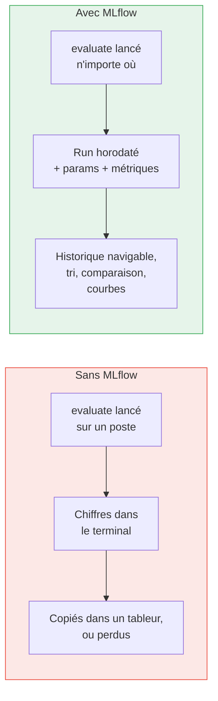
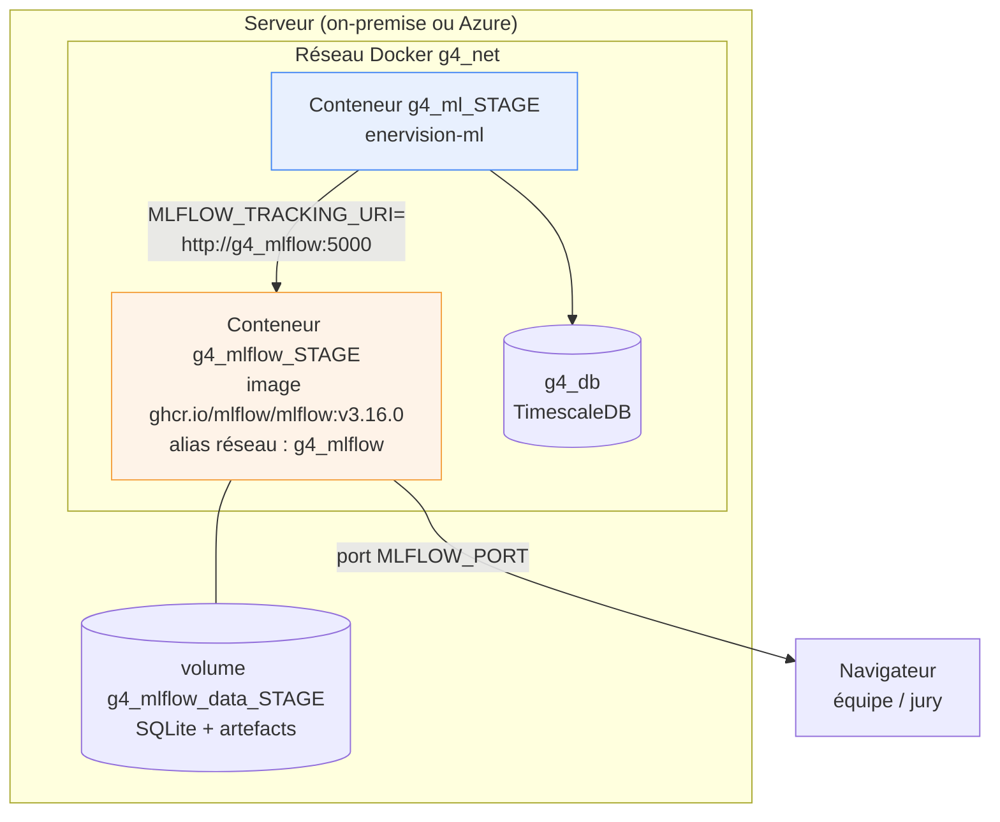
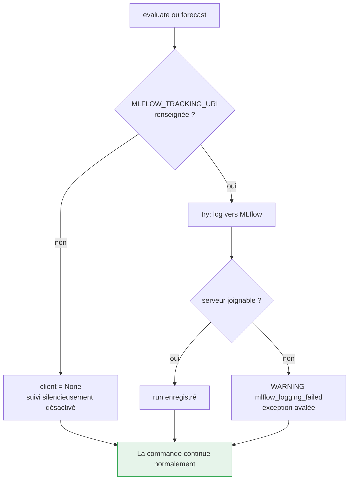
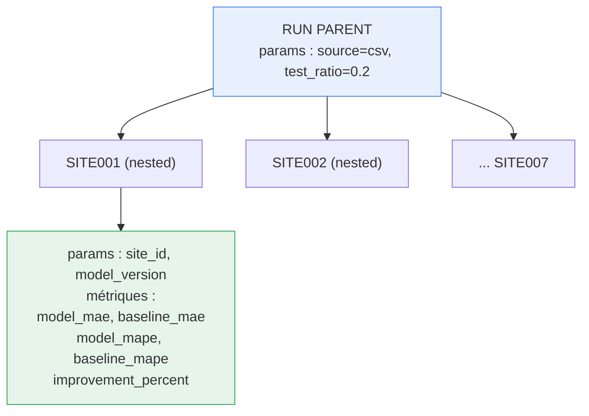
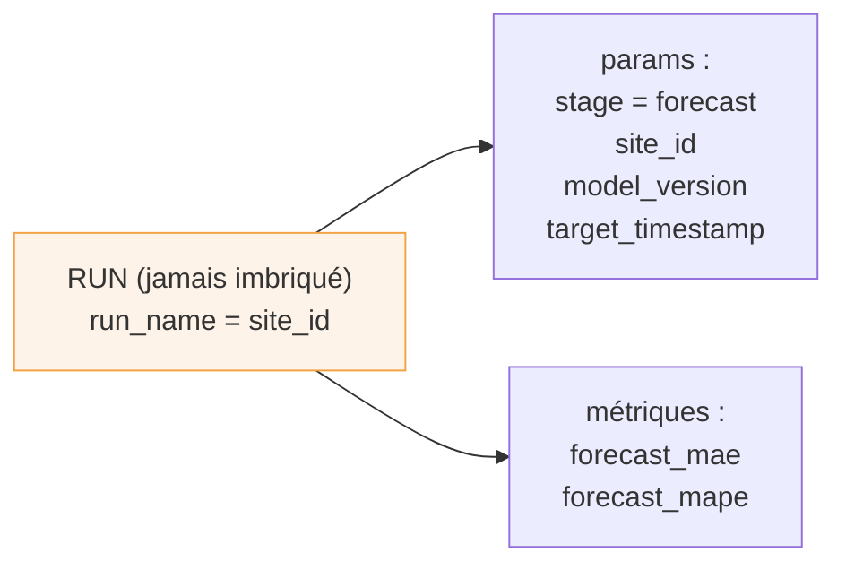
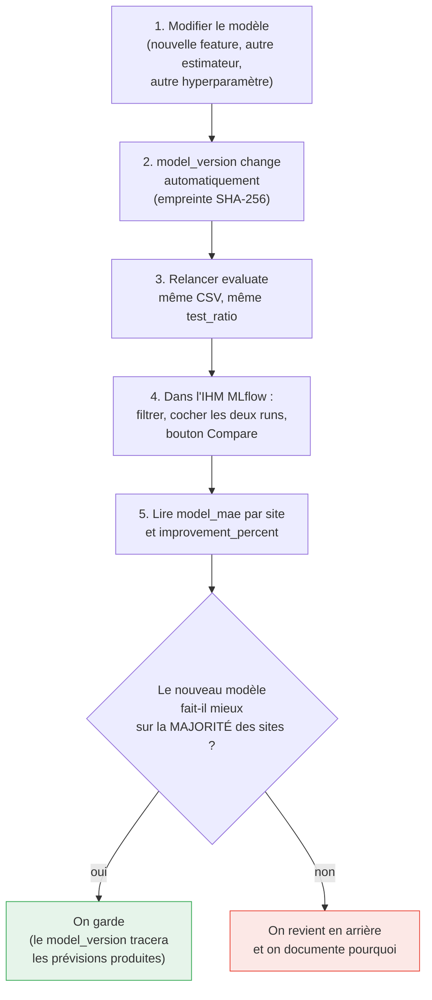

# 5. MLflow : le suivi d'expériences

## 5.1 À quoi ça sert, en une phrase

Sans outil de suivi, les résultats d'une évaluation vivent dans le terminal de celui qui
l'a lancée, et disparaissent avec lui. **MLflow est le carnet de laboratoire du projet** :
chaque évaluation y dépose ses paramètres et ses métriques, horodatés, consultables par
tout le monde, et surtout **comparables entre eux**.



## 5.2 Le déploiement

MLflow est de l'**infrastructure**, pas du code applicatif : il est déclaré dans
`enervision-devops`, au même titre que la base et le broker Kafka.



Fichier : `enervision-devops/compose/mlflow.yml`. Déploiement :
`.github/workflows/deploy-mlflow.yml`, en `workflow_dispatch` manuel (dev ou prod) comme
la base et le broker, puisqu'aucun dépôt de service ne le déclenche : c'est une image
officielle publique, il n'y a rien à construire.

### Les cinq décisions de ce compose, et leurs raisons

| Décision | Raison |
|---|---|
| **Backend SQLite** (`sqlite:////mlflow/data/mlflow.db`) plutôt que la base TimescaleDB partagée | Seules des métriques d'évaluation ponctuelles transitent. Rien ici n'a besoin d'être une hypertable ni d'être partagé avec un autre service. SQLite évite de coupler le suivi à la santé de la base métier |
| **`--workers 1`** au lieu des 4 par défaut | Serveur interne à très faible trafic sur un hôte partagé entre plusieurs groupes |
| **`--allowed-hosts` explicite** | MLflow 3 refuse par défaut (protection anti DNS-rebinding) tout en-tête `Host` qui n'est ni `localhost` ni une IP privée, **reconnue par un test littéral sur la chaîne**, pas par résolution DNS. Or `g4_mlflow` est un nom, pas une IP : sans cet ajout, chaque appel du client serait rejeté en 403. Le drapeau **remplace** le défaut au lieu de le compléter, la couverture localhost / IP privées est donc recopiée explicitement pour garder l'IHM navigable depuis le réseau interne |
| **`mem_limit: 1g`**, pas 512 Mo | Mesuré en pratique : à 512 Mo, FastAPI/SQLAlchemy/alembic dépassent le plafond dès le démarrage et le conteneur entre en cycle de redémarrage perpétuel |
| **Healthcheck en `python -c urllib`** | L'image officielle n'embarque ni `curl` ni `wget`, seulement Python |

Ces points ne sont pas de la coquetterie : le troisième en particulier produit une panne
**silencieuse** (le client avale l'erreur, `evaluate` réussit, mais aucune métrique
n'arrive), donc difficile à diagnostiquer après coup. Il est documenté dans le compose.

### Côté service ML

Une seule variable, avec un défaut vide :

```yaml
# compose/ml.yml
MLFLOW_TRACKING_URI: ${MLFLOW_TRACKING_URI:-}
```

```yaml
# envs/onprem.env.example
MLFLOW_TRACKING_URI=http://g4_mlflow:5000   # l'alias réseau, jamais l'IP du serveur
```

L'alias réseau interne et non l'IP publique : seul `g4_ml` a besoin de joindre le serveur,
et l'IP changerait à chaque migration d'hôte.

## 5.3 Le client : `mlflow-skinny`, et best-effort

Deux choix de conception, dans `orchestration/experiment_tracking.py`.

**`mlflow-skinny` et non `mlflow`** : le paquet complet embarque Flask, gunicorn, pandas et
pyarrow, c'est-à-dire le **serveur**. Ce service n'est que client : il n'a besoin que de
`start_run`, `log_param`, `log_metric`, `end_run`. L'image ML pèse déjà lourd à cause de la
chaîne scientifique, il n'y avait aucune raison d'y ajouter un serveur web inutilisé.

**Le suivi ne peut jamais faire échouer l'appelant** :



C'est ce qui garde `evaluate --source csv` utilisable **hors ligne, sans aucune variable
d'environnement**, y compris sans `DATABASE_URL` : le suivi lit `MLFLOW_TRACKING_URI`
directement dans l'environnement, sans passer par la configuration validée du service.

Un serveur de suivi en panne est un problème d'observabilité, jamais un problème de
production : les prévisions doivent continuer à s'écrire.

## 5.4 Ce qui est journalisé

Deux formes de runs, délibérément distinguées.

### `evaluate` : un run parent, un run enfant par site



La structure imbriquée donne dans l'IHM la lecture qu'on veut : un lot d'évaluation se
replie en une ligne, et se déplie site par site.

### `forecast` : un run plat par mesure de justesse



Pas de run parent ici : contrairement à `evaluate`, chaque site est jugé indépendamment, à
son propre rythme, il n'y a pas de lot commun à rattacher. Le paramètre `stage=forecast`
est ce qui permet de ne pas confondre les deux familles dans l'IHM.

### Tableau récapitulatif

| Champ | `evaluate` | `forecast` |
|---|---|---|
| `source` | csv / database | — |
| `test_ratio` | 0.2 | — |
| `stage` | — | `forecast` |
| `site_id` | oui | oui |
| `model_version` | oui | oui |
| `target_timestamp` | — | oui |
| `model_mae` / `baseline_mae` | oui | — |
| `model_mape` / `baseline_mape` | oui | — |
| `improvement_percent` | oui | — |
| `forecast_mae` / `forecast_mape` | — | oui |

**Aucun artefact, aucun modèle n'est journalisé.** Le service n'en persiste aucun (voir
[Le modèle, 2.6](02-le-modele.md)), il n'y a donc rien à versionner côté artefacts. Le
`--default-artifact-root` du compose existe parce que MLflow l'exige, il reste vide en
pratique.

## 5.5 Comparer deux modèles : la procédure

C'est la question que pose un jury. La réponse tient en une règle et cinq étapes.

**La règle** : deux résultats ne sont comparables que si les métriques ont été calculées
sur **les mêmes vérités**. C'est pourquoi `model_mae` et `baseline_mae` sont journalisées
dans le même run enfant : elles sont produites sur exactement le même jeu de test.



### Ce qu'on regarde, dans l'ordre

1. **`improvement_percent`** en premier. C'est la seule métrique déjà normalisée par la
   difficulté du site : elle répond à « le modèle apporte-t-il quelque chose ? »
   indépendamment de la taille du site.
2. **`model_mae` par site**, à `test_ratio` et jeu de données identiques. Un `model_mae` qui
   baisse sur six sites et remonte sur un seul est un progrès ; l'inverse est du bruit.
3. **`model_mape`** pour comparer des sites entre eux, la MAE ne s'y prêtant pas (42 kW
   d'erreur n'ont pas le même sens sur un site de 60 kW et un site de 2 000 kW).
4. **`forecast_mae`** dans la durée, une fois le modèle déployé : c'est la seule métrique
   mesurée en conditions réelles, avec la climatologie à la place de la météo observée.

### Les pièges qu'un jury peut soulever

| Piège | Ce qui protège le projet |
|---|---|
| « Vous comparez des runs sur des données différentes » | `source` et `test_ratio` sont journalisés comme paramètres : un run sur un autre jeu se voit immédiatement |
| « Vous avez changé les features sans le dire » | Impossible : `model_version` est un condensat des features **et** de leur ordre, il change tout seul |
| « Votre modèle est meilleur par chance » | La comparaison porte sur sept sites indépendants, pas sur un seul, et le découpage est chronologique (pas de fuite de données) |
| « Le chiffre en soutenance ne dit rien de la production » | C'est explicitement reconnu : `evaluate` est optimiste (température réelle) et `forecast_mae` mesure le régime réel |

### Requête de filtrage dans l'IHM

```
params.stage = "forecast" and params.site_id = "SITE001"
```

pour suivre la justesse en production d'un site, ou :

```
metrics.improvement_percent > 0
```

pour ne garder que les sites où le modèle bat la baseline.

## 5.6 Ce que MLflow n'assure pas ici

- **Pas de Model Registry** : aucun modèle n'est enregistré, donc pas de cycle
  Staging/Production. Le service réentraîne à chaque lot, la notion de « modèle promu » n'a
  pas d'objet.
- **Pas de déploiement de modèle par MLflow** (`mlflow models serve`) : le service ML
  prédit lui-même, il ne consomme aucun endpoint.
- **Pas d'authentification** sur le serveur de suivi : il n'est joignable que sur le réseau
  interne, et le port exposé est celui d'un hôte déjà restreint. À durcir si le service
  sortait du périmètre pédagogique.

Suite : [Déploiement et exploitation](06-deploiement-et-exploitation.md)
