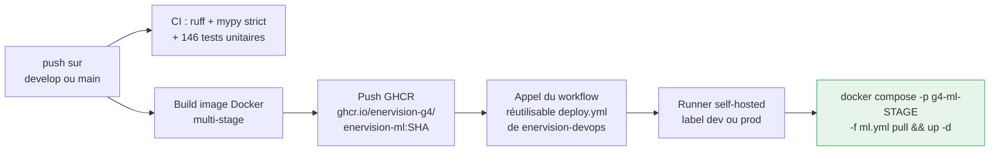
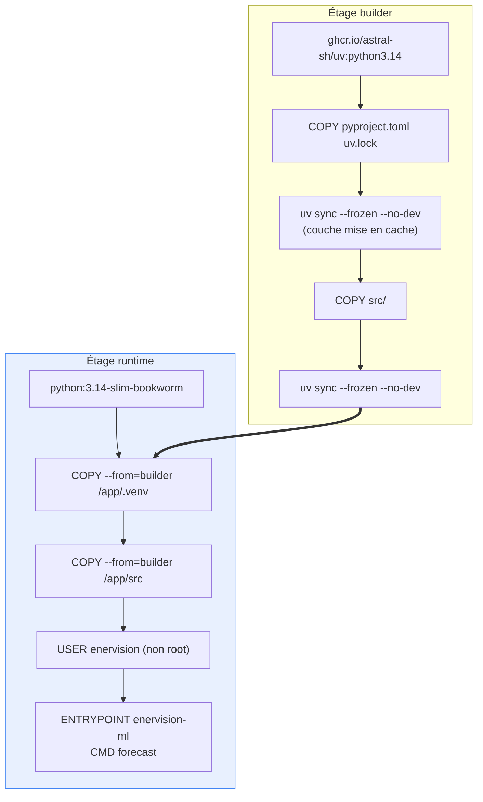
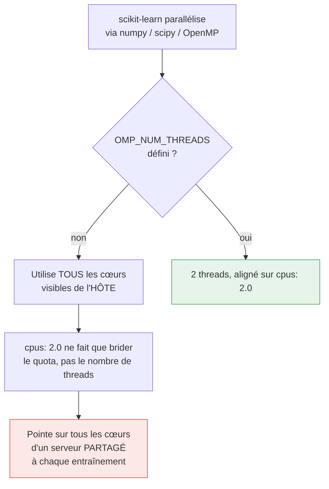
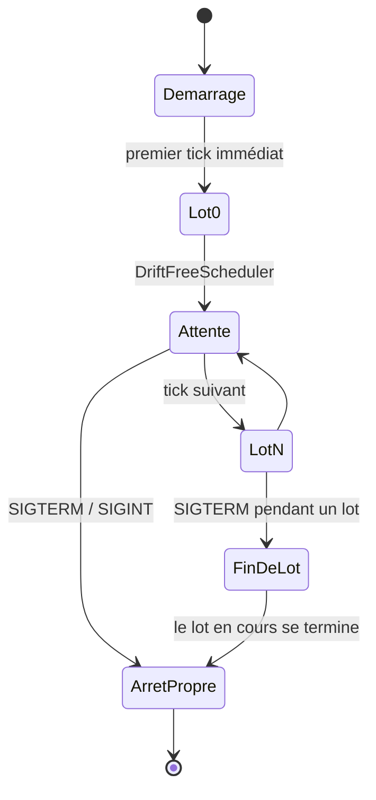
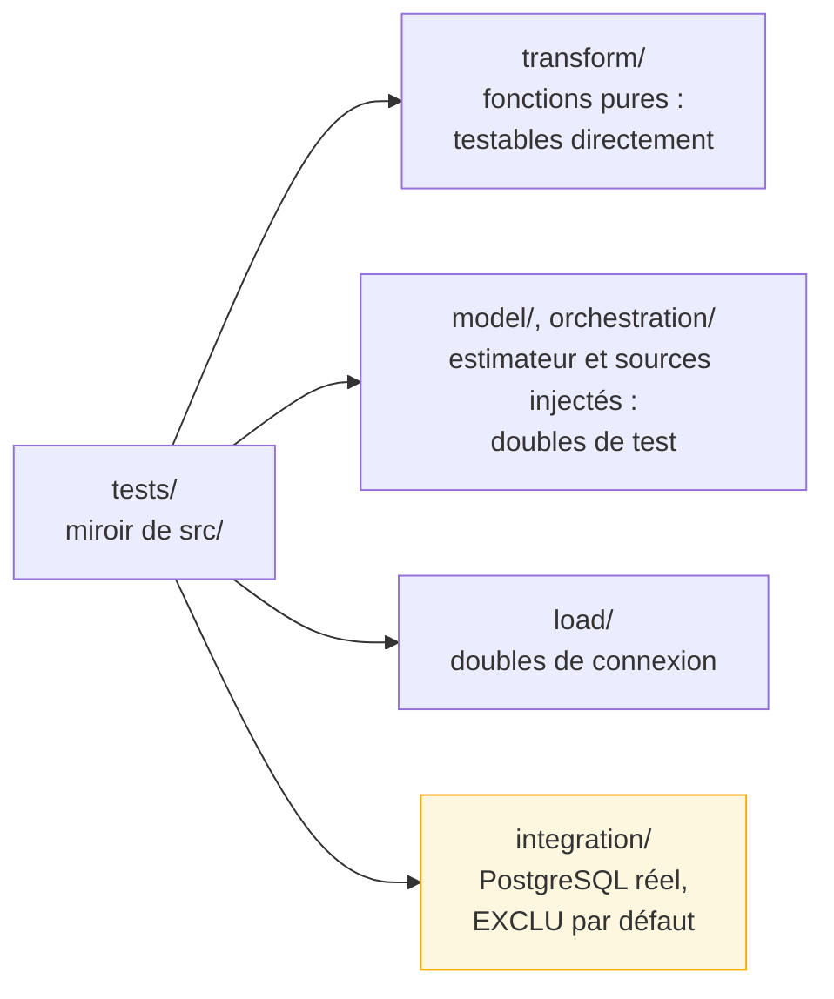

# 6. Déploiement et exploitation

## 6.1 De la branche au conteneur



| Branche | `stage` | Conséquence |
|---|---|---|
| `develop` | `dev` | Conteneur `g4_ml_dev`, environnement GitHub `onprem-dev` |
| `main` | `prod` | Conteneur `g4_ml_prod`, environnement GitHub `onprem-prod` |

Le tag de l'image est le **SHA du commit**, jamais `latest` : l'image tournant en
production est traçable jusqu'à la ligne de code. Le même SHA est aussi injecté comme
variable `BUILD_REF` dans l'image, donc visible dans les journaux du conteneur.

Le déploiement passe par des **runners self-hosted** avec le socket Docker de l'hôte
monté : le serveur on-premise n'est joignable que depuis le réseau de l'école, un runner
GitHub hébergé ne pourrait pas s'y connecter. Le job s'exécute donc directement « sur » le
serveur, sans SSH.

## 6.2 L'image



Quatre points d'attention :

- **Les dépendances sont copiées avant le code source** : la couche `uv sync` n'est
  reconstruite que si `uv.lock` change, pas à chaque modification d'un module.
- **L'étage final ne contient ni `uv` ni chaîne de compilation**, seulement
  l'environnement résolu.
- **Utilisateur dédié, jamais root** : un processus compromis n'aurait pas les droits de
  l'hôte dans le conteneur.
- **`ENTRYPOINT` en forme exec** : indispensable pour que `SIGTERM` parvienne au processus
  Python. C'est ce qui rend possible l'arrêt propre (6.4).

L'image est nettement plus lourde que celle de `enervision-etl` : la chaîne scientifique
compilée (`scikit-learn`, `scipy`, `numpy`) domine la taille. Il n'y a rien de raisonnable
à faire pour la réduire sans changer d'estimateur — ce serait payer une régression de
qualité pour des mégaoctets.

## 6.3 Le compose et les limites de ressources

`enervision-devops/compose/ml.yml` :

```yaml
cpus: 2.0
mem_limit: 1g
environment:
  OMP_NUM_THREADS: "2"
  OPENBLAS_NUM_THREADS: "2"
```

Ces deux variables d'environnement méritent une explication, parce que leur absence est un
bug discret :



Le serveur est partagé entre plusieurs groupes : un service qui fait une pointe sur tous
les cœurs, même brièvement, dégrade les autres.

## 6.4 Le cycle de vie du conteneur



Deux mécanismes soutiennent ce cycle.

**`DriftFreeScheduler`** : un simple `sleep(3600)` dérive, parce qu'il attend *après* le
traitement — le cycle réel dure 3600 s **plus** la durée du traitement, et l'écart
s'accumule jour après jour. Ici les instants de déclenchement sont calculés depuis une
ancre fixe, jamais depuis l'instant courant, sur une horloge **monotone** (un ajustement
NTP ou un passage à l'heure d'été ferait sauter ou figer une boucle basée sur l'horloge
murale). Si un cycle déborde d'une période entière, les ticks manqués sont abandonnés
plutôt qu'empilés, faute de quoi la boucle tournerait en continu pour rattraper un retard
déjà pris.

**`ShutdownRequest`** : Docker envoie `SIGTERM` puis, après un délai de grâce, `SIGKILL`.
Or Python interrompt le processus sur `SIGTERM` sans exécuter les blocs `finally` : un lot
serait coupé entre deux commits de sites. Le signal ne fait donc que **lever un drapeau**,
consulté entre deux cycles et pendant l'attente, découpée en tranches de 0,25 s pour que
la réaction soit immédiate.

## 6.5 Configuration

Une seule variable est obligatoire : `DATABASE_URL`. Tout le reste a un défaut, ce qui
permet à `ml.yml` de rester valide sans être modifié.

| Variable | Rôle | Défaut |
|---|---|---|
| `DATABASE_URL` | Source (`measure_imputed`) et destination des prévisions | *obligatoire* |
| `TRAINING_SOURCE` | `database` ou `csv` | `database` |
| `CSV_PATH` | Chemin du CSV, obligatoire si `TRAINING_SOURCE=csv` | — |
| `CSV_SOURCE_TIMEZONE` | Fuseau des horodatages naïfs du CSV | `UTC` |
| `FORECAST_INTERVAL_SECONDS` | Cadence de la boucle | `3600` |
| `HORIZON_HOURS` | Heures de prévision par site et par lot | `24` |
| `MIN_TRAINING_HOURS` | Historique minimal exigé pour entraîner | `168` (7 jours) |
| `THRESHOLD_RATIO` | Fraction de `capacity_kw` retenue comme seuil | `0.85` |
| `MLFLOW_TRACKING_URI` | Serveur de suivi ; vide = suivi désactivé | *vide* |
| `LOG_LEVEL` / `LOG_AS_JSON` | Journalisation | `INFO` / `true` |

La configuration est validée **au démarrage** par Pydantic : une valeur manquante ou un
schéma d'URL invalide fait échouer immédiatement, avec un message explicite, plutôt
qu'après plusieurs minutes de fonctionnement.

Deux nettoyages défensifs y sont codés, tous deux issus de problèmes réels :

- les espaces et retours chariot autour de chaque valeur sont retirés (un `.env` enregistré
  sous Windows termine ses lignes par `\r`, que Docker transmet tel quel) ;
- un suffixe de pilote SQLAlchemy (`postgresql+psycopg://`) est retiré du schéma : cette
  forme n'a de sens que pour SQLAlchemy, alors que `psycopg`, utilisé directement ici,
  attend un schéma nu. Le `DATABASE_URL` est partagé entre tous les services du parc, dont
  certains utilisent SQLAlchemy.

## 6.6 Vérification et qualité

```bash
uv run pytest                              # 146 tests, aucune infrastructure requise
uv run ruff check src tests scripts        # style + docstrings Google obligatoires
uv run mypy                                # typage strict sur src et scripts
```



Les tests d'intégration sont marqués `integration` et exclus par défaut : la suite doit
passer sur n'importe quelle machine, sans base. Ils vérifient ce que des doubles ne peuvent
pas prouver — les sémantiques qui appartiennent réellement à PostgreSQL, comme le
comportement de `ON CONFLICT DO NOTHING`.

`scripts/seed_measure_imputed.py` peuple une base locale d'un historique synthétique, pour
tester `forecast` sans attendre que le consumer de persistance ait tourné.

## 6.7 Limites connues, assumées

| # | Limite | Statut |
|---|---|---|
| 1 | **`restart: unless-stopped` dans `ml.yml`** relance le conteneur même sur un arrêt volontaire (code 0). C'est pourquoi `CMD ["forecast"]` boucle en interne plutôt que de s'appuyer sur un redémarrage Docker par lot. `restart: on-failure` serait plus juste | À signaler à l'équipe devops |
| 2 | **`scripts/restore.sh` efface les prévisions côté Azure.** Une restauration (`pg_restore --clean --if-exists`) recrée les tables depuis le dump on-premise : toute prévision produite localement disparaît, et la migration de contrainte doit être rejouée | Point ouvert avec l'équipe devops |
| 3 | **Météo optimiste dans `evaluate`** : le gain mesuré utilise la température observée, la production se rabat sur la climatologie | Assumé et documenté, mesuré par `forecast_mae` |
| 4 | **Pas de features retardées** (lag 24 h / 168 h) : le levier de précision le plus important, absent en v1 | Écarté sciemment, `FEATURE_NAMES` conçu pour l'accueillir |

Suite : [FAQ jury](07-faq-jury.md)
